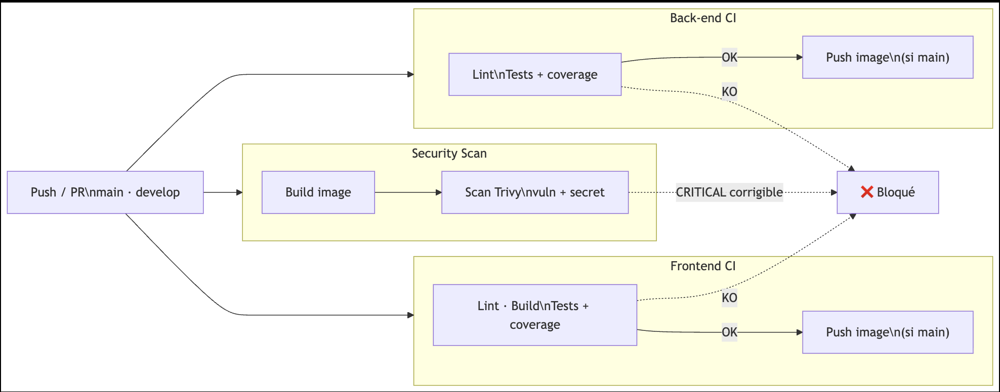

# Valorisation Donnée Météo

## Approche DevOps

j'ai aborder ce projet sur 3 partie: 

1. **[Pipelines CI/CD](#1-pipelines-cicd)**: trois workflows GitHub Actions indépendants : CI front-end, CI back-end et scan de sécurité Trivy.
2. **Métriques Prometheus & Grafana**
3. **Docker hardening** 

## 1. Pipelines CI/CD

**3 workflows GitHub Actions** indépendants, déclenchés sur `push` / `pull_request` (`main`, `develop`) :

| Workflow | Rôle | Déclencheurs additionnels |
| --- | --- | --- |
|  [Frontend CI](.github/workflows/frontend-ci.yml) | Lint → build → tests vs vrai back-end → push image | — |
| ️[Back-end CI](.github/workflows/back-end-ci.yml) | Lint → tests vs vraie TimescaleDB → push image | — |
|  [Security Scan](.github/workflows/security-scan.yml) | Build → scan Trivy (CVE + secrets) | cron lundi 4h UTC, manuel |

### 1.1 Étapes clés par workflow

| # | Frontend CI | Back-end CI | Security Scan | Bloquant ? |
| --- | --- | --- | --- | --- |
| 1 | Build & run image back-end (Docker) | Service `timescaledb` (health check) | Build image (`frontend` / `backend`, matrice) | ✅ |
| 2 | `npm run lint` | `ruff check --output-format=github` | Installation Trivy (v0.74.0) | ✅ |
| 3 | `npm run build` | `uv sync --locked` | `trivy image --scanners vuln,secret` → `results.json` | ✅ |
| 4 | Attente API back-end (`timeout 120s`) | `pytest --cov` (unit + intégration) | Publication du rapport complet (`trivy convert`) | ✅ (4) / — (5) |
| 5 | `npm run test:ci:coverage` (vs API réelle) | Résumé couverture → job summary | **Gate** : `--exit-code 1 --severity CRITICAL --ignore-unfixed` | ✅ |
| 6 | Résumé couverture → job summary | — | — | ⚠️ info only |
| 7 | Push image sur `main` uniquement | Push image sur `main` uniquement | — | conditionnel |

### 1.2 Résultats

| Statut | Frontend CI / Back-end CI | Security Scan |
| --- | --- | --- |
| ✅ **Succès** | Badge vert · image poussée sur `main` · résumé de couverture publié | Badge vert · rapport complet publié (même si `HIGH`/`MEDIUM` présents) |
| ⚠️ **Avertissement** | Couverture < seuil → job **réussi** quand même + `::warning` dans le résumé | CVE sans correctif ou non-`CRITICAL` → listée mais non bloquante |
| ❌ **Échec** | Lint/build/test KO → job stoppé, `docker-push` **ne démarre pas** (`needs`), aucune image poussée | CVE `CRITICAL` corrigible détectée → job échoue (`exit-code 1`), CVE listée dans le résumé |

---

## 2. Métriques Prometheus & Grafana

**But** : observer la santé du back-end en continu pour détecter une régression de performance avant qu'elle n'impacte les utilisateurs.

### 2.1 Étapes de mise en place

| # | Étape | Détail |
| --- | --- | --- |
| 1 | Dépendance | `uv add django-prometheus`, ajoutée dans [`backend/pyproject.toml`](backend/pyproject.toml) |
| 2 | Exposition de l'endpoint | Middlewares `PrometheusBeforeMiddleware` / `PrometheusAfterMiddleware` encadrant la stack Django ([`settings.py`](backend/config/settings.py)) + `path("", include("django_prometheus.urls"))` ([`urls.py`](backend/config/urls.py)) → expose `GET /metrics` |
| 3 | Image Prometheus | `prom/prometheus:v3.1.0` ajoutée au [`docker-compose.dev.yml`](docker-compose.dev.yml), config montée en lecture seule depuis [`prometheus.yml`](prometheus.yml) |
| 4 | Configuration du scrape | Job `backend` ciblant `backend:8000` (nom du service Docker sur le réseau `app_net`) toutes les 15s ([`prometheus.yml`](prometheus.yml)) |
| 5 | Image Grafana | `grafana/grafana:11.4.0` ajoutée au compose, dépend de `prometheus`, volume `grafana-data` persistant |
| 6 | Attachement Grafana ↔ Prometheus | Datasource provisionnée automatiquement au démarrage via [`grafana/provisioning/datasources/prometheus.yml`](grafana/provisioning/datasources/prometheus.yml) → `http://prometheus:9090`, marquée `isDefault` (aucune config manuelle requise) |
| 7 | Premier dashboard | Créé dans Grafana avec les requêtes PromQL ci-dessous |

## 3. Docker hardening

https://hub.docker.com/hardened-images/catalog/dhi/node/images/node%2Falpine-3.24%2F24-dev/sha256-6fd7e7eae95353eec32cda7d5335597044d81dc5dbb1a8715473523758abf188
https://hub.docker.com/hardened-images/catalog/dhi/python/images/python%2Fdebian-13%2F3.12-dev/sha256-46e88e66858e29420227016dede467684e99bdd3665e86249013f7b28e0cf4b5
